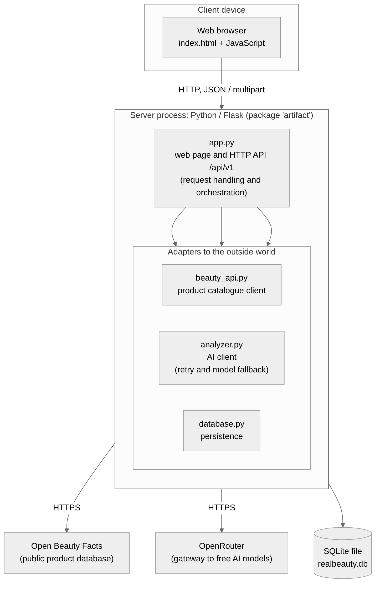
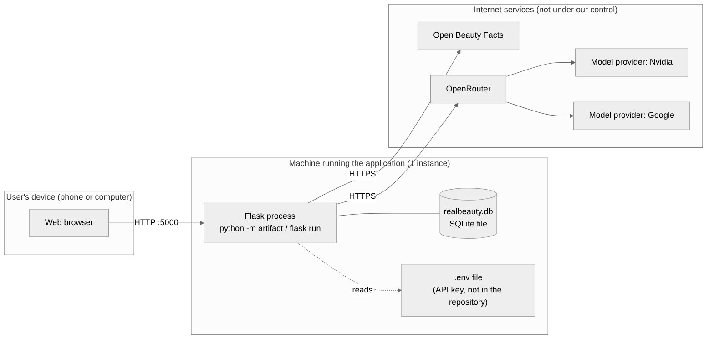
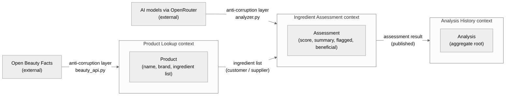
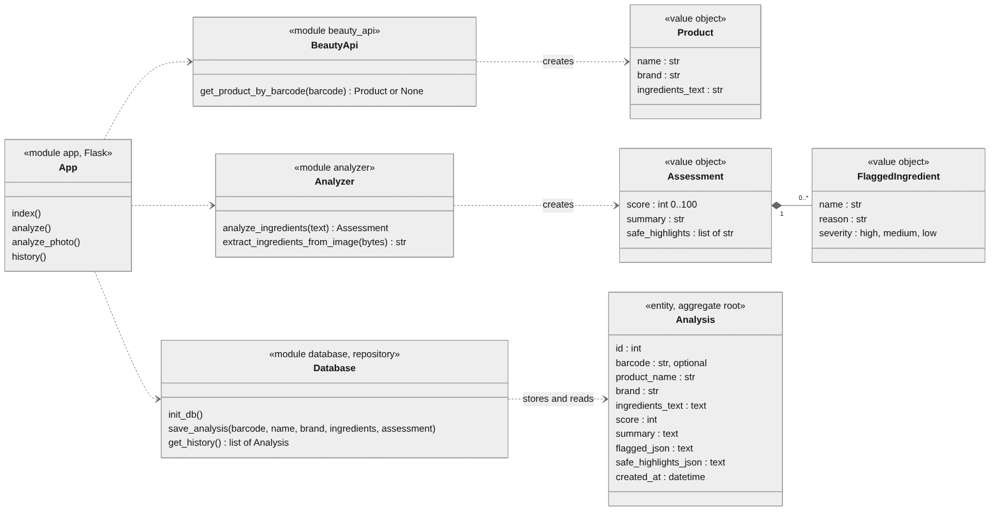
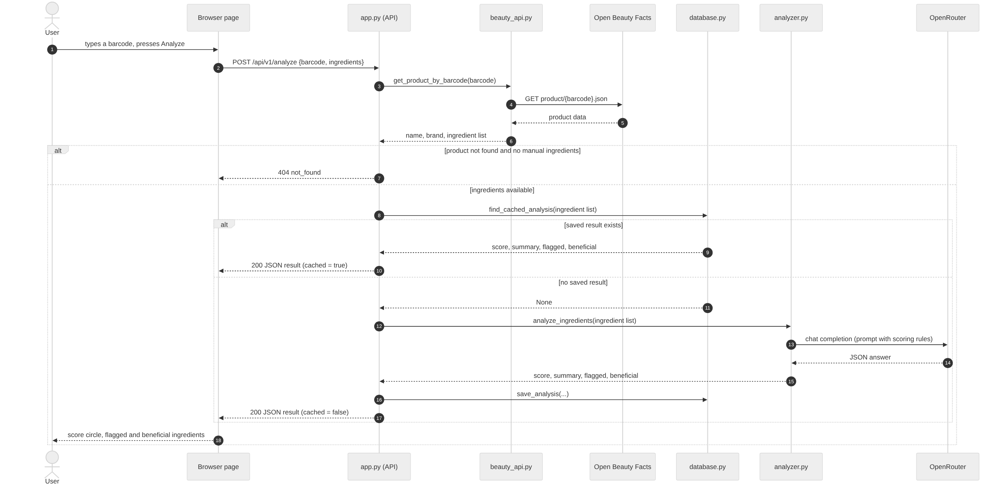
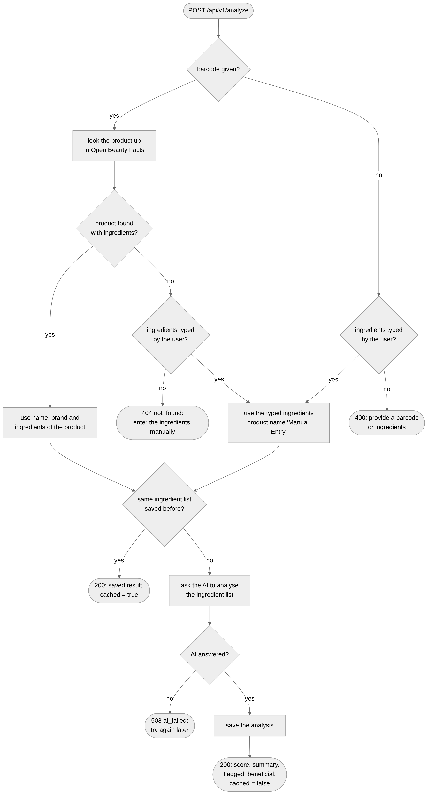
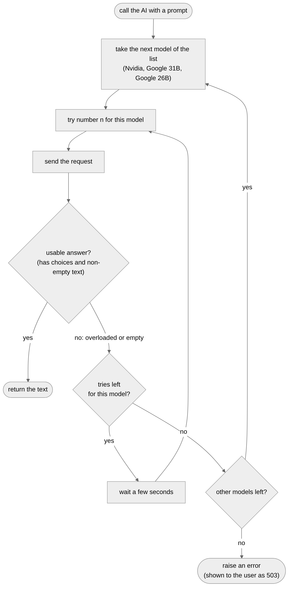

# Design

## Architecture

**Architectural style: layered (3 layers), in a client-server setting.**

RealBeauty is a web application. The browser is the client, a single Flask server is the server, and the server code is split into three layers. Each layer only talks to the layer right below it.

| Layer | What it does | Code |
|-------|--------------|------|
| 1. Presentation | Shows the input form, the result (score, summary, ingredient lists) and the list of past analyses. | `templates/index.html` |
| 2. Application logic | Receives requests, checks the input, decides the order of the steps (including whether a saved result can be reused), returns clear errors (400, 404, 422, 503). | `app.py` |
| 3. Data and integration | Talks to everything outside: Open Beauty Facts (`beauty_api.py`), the AI models (`analyzer.py`) and the database (`database.py`). | three modules |

**Why a layered style?**

- The system is a simple chain: the user sends a request, the server does a few steps one after the other (find the product, judge the ingredients, save the result) and sends one answer back. A layered structure matches this directly.
- Each outside service sits in its own module in layer 3. If the AI model or the product database is changed, only that module changes.
- In the tests, layer 3 is replaced by fakes, so the tests need no network and no API key (see [Validation](../05-validation/)).

**Why not the other styles?**

| Style | Why it was not used |
|-------|-----------------------|
| Object-based | The domain is tiny (one stored entity). Splitting it into many collaborating objects would add code without benefit. |
| Event-based / message queues | Nothing has to happen "later" or in the background. The user waits for the result, so a broker and workers would only add cost and failure points. |
| Shared dataspace | The components do not cooperate by reading and writing a common space. They call each other in a fixed order. |
| Service-oriented / microservices | There is one small application and one developer. Splitting it into services would add networking and deployment work and solve no real problem. |
| Hexagonal (ports and adapters) | Very close to the chosen structure, but there are no explicit "port" interfaces. There is only one implementation of each adapter, so a plain layered structure is simpler. |

**Versioning.** All analysis routes live under `/api/v1`. A future incompatible change can be published as `/api/v2` while `/api/v1` keeps working (FR15).

## Infrastructure

The system runs as **one server process**.

| Component | How many | Notes |
|-----------|----------|-------|
| Browser (client) | any | On the user's phone or computer. |
| Flask server | 1 | Serves the page and the API. |
| SQLite database | 1 | A file next to the server, no database server. |
| Open Beauty Facts | 1, external | Public service, not controlled by the project. |
| OpenRouter (and the AI providers behind it) | 1, external | Free models. |

Load balancers, separate cache servers (such as Redis), message queues and workers were deliberately left out. The expected load is a few requests per user per day, so they would add complexity and solve nothing. Saved results are reused directly from the SQLite database that already stores the history (see [Data-related aspects](#data-related-aspects)), so no extra component was needed for that.

The server and the database file are on the same machine. The browser reaches the server over HTTP (by default `http://127.0.0.1:5000`). The server reaches the two external services over HTTPS; their addresses are fixed in the code. The OpenRouter key is read from a `.env` file on the server and is never published.

## Modelling

### Domain driven design (DDD) modelling

The domain is small, so the modelling was kept light. Three **bounded contexts** were identified:

| Context | About | Main concepts |
|---------|-------|---------------|
| Product Lookup | Finding a product from its barcode. | *Product* (name, brand, ingredient list). |
| Ingredient Assessment | Judging an ingredient list. | *Assessment* (score, summary, beneficial ingredients), *Flagged ingredient* (name, reason, severity). |
| Analysis History | Remembering past analyses. | *Analysis*: the stored record, and the aggregate root. |

- The *Analysis* has a repository: the functions in `database.py` (`save_analysis`, `get_history`, `find_cached_analysis`).
- `beauty_api.py` and `analyzer.py` also translate outside data into the concepts of the application, so outside formats do not spread into the rest of the code (an *anti-corruption layer*).
- Domain events (*product found*, *assessment completed*, *analysis saved*) exist only as steps of one request, not as event objects.
- The scoring rule (start at 100, subtract 20, 10 or 3 per ingredient by severity, add 2 per beneficial one) is written in the AI prompt and applied by the model. The code does not recompute it. This keeps the code small, but the score is only as consistent as the model (see [Self-evaluation](../11-selfevaluation/)).

### Object-oriented modelling

The code is made of modules with functions. The only class is the stored *Analysis*. *Product* and *Assessment* are passed between modules as dictionaries; the figure shows their structure.

### Distributed system aspects

| Concept | Created by |
|---------|-----------|
| Product | the catalogue client, from Open Beauty Facts data |
| Assessment | the AI client, from the model's answer |
| Analysis | the database module, at the end of a successful request |

The only lasting state is the saved analyses, in the database file. The server keeps nothing between requests (no sessions, no users).

Messages:

- Browser to server: JSON with `barcode` and/or `ingredients`, or a form with a `photo`.
- Server to browser: JSON with `product_name`, `brand`, `score`, `summary`, `flagged`, `safe_highlights` and `cached` (true when the result was read from the database); or an error with `error` and `message`.
- Server to browser, for the history: a list of saved analyses, each with the fields above plus `method` (barcode, manual or photo) and the first characters of the ingredient list.
- Server to Open Beauty Facts: a request for one barcode.
- Server to the AI service: a chat request with the prompt (and the image, for a photo).

## Interaction

All communication is **synchronous request-reply** over HTTP. The browser sends a request and waits, showing a progress bar. The server calls the product database, then looks for a saved result for the same ingredient list; only if there is none does it call the AI service. Then it replies.

- **Manual ingredients:** the barcode lookup is skipped.
- **Photo:** the server first asks an image-capable model to read the ingredient list, then analyses the text as above.
- **Saved result:** if the same ingredient list was analysed before, the answer comes from the database at once, with `cached` set to true, and nothing new is saved. With a barcode, Open Beauty Facts is still asked first, because the saved result is found by its ingredient list, not by the barcode.
- **History:** `GET /api/v1/history` returns the saved analyses, newest first, with each ingredient list only once. The web page calls it when it opens and after each analysis.

| Code | Meaning | When |
|------|---------|------|
| 200 | Result | Analysis completed. |
| 400 | Missing input | No barcode, no ingredients, or no photo. |
| 404 | `not_found` | Unknown barcode or no ingredients, and none typed. |
| 422 | Unreadable photo | The text read from the photo is empty. |
| 503 | `ai_failed` | The AI could not answer, even after retries. |

## Behaviour

The page, the API layer and the two clients are **stateless**; only the database is **stateful**. Only the API layer changes the state, and only **after** the AI analysis has succeeded, so a failed request leaves nothing in the database.

Free AI models are often busy, so the AI client does not give up at the first failure. It retries, then moves to the next model in a list, and reports an error only when all have failed.

The web page is always in one of four situations: waiting for input; waiting for an answer (progress bar, results hidden); showing a result (inputs cleared); showing an error (inputs kept, so the user can retry). The list of past analyses is always shown below. At most one of its rows is open at a time; "Show details" puts the saved result in the result area, as if it had just been analysed, with a note that it comes from the history.

## Data-related aspects

**What is stored.** One record per completed analysis, in a SQLite file: barcode (if any), product name, brand, the analysed ingredients, score, summary, flagged and beneficial ingredients, and creation time (UTC). The purposes are to let users review past analyses (US9) and to return the same result again for the same product (US11). Photos are not stored.

**Why SQLite.** The data are flat records that are added, listed and looked up by one field. SQLite needs no server and no configuration, which suits one machine and one user. The flagged and beneficial ingredient lists are kept as JSON text inside the record because they are only displayed, never queried. Records saved by versions before 1.3.0 used the text form of a Python list instead of JSON; these are still read correctly (see [Development](../04-development/)).

**Saved results (cache).** The key of a saved result is the analysed ingredient list. Extra spaces and line breaks are removed before saving, and the lookup ignores upper and lower case, so the same list typed slightly differently is still recognised. The newest record for a list is the one reused, and the history shows only that one, so the user always sees the same score for the same list. The barcode is not used as the key, because the same ingredient list can come from a barcode, from typing or from a photo. A label photo is read again by the AI at each upload, and small differences in the text read (one letter can change) mean that saved results are found less often for photos than for barcodes and typed lists.

**Operations.** One lookup by ingredient list before each analysis, one insert after each new successful analysis, and one read of the whole history, newest first (no paging, since the data are small). Each operation opens and closes its own database session. SQLite serialises writers, which is enough for a few users.

No data are shared between components at run time: the analysis passes along as an in-memory value during a request and is stored once at the end.
