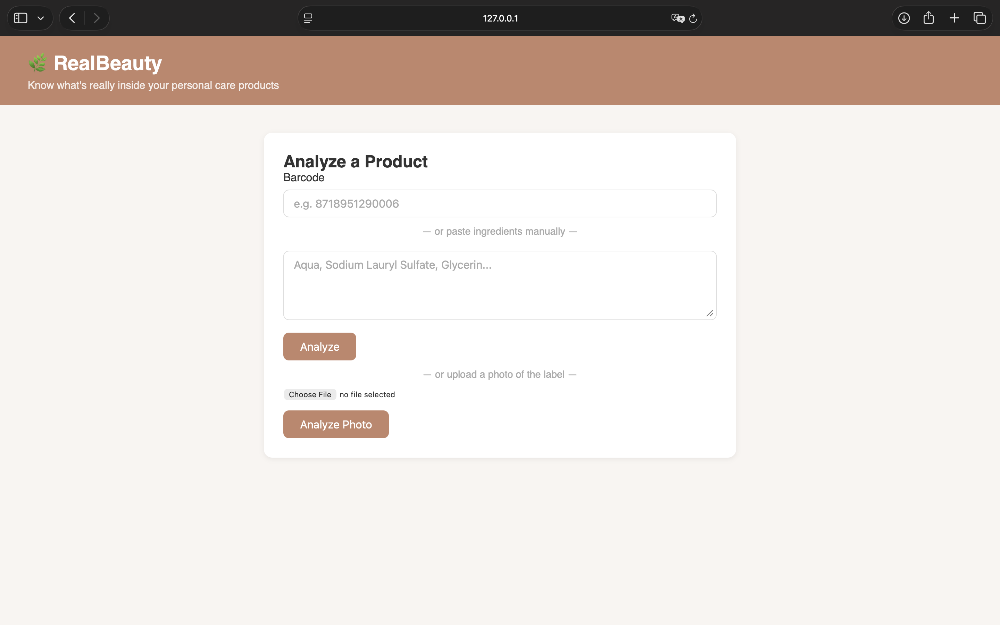
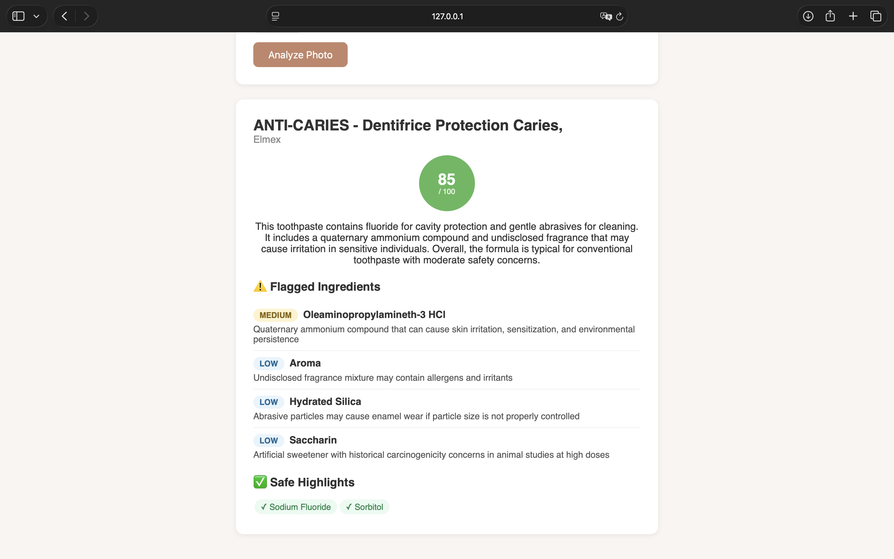
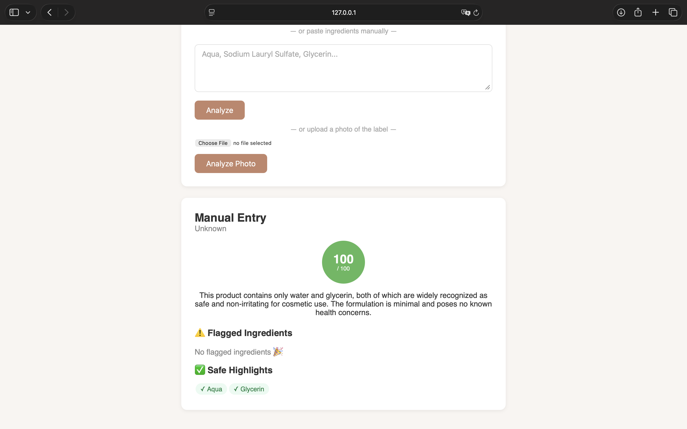
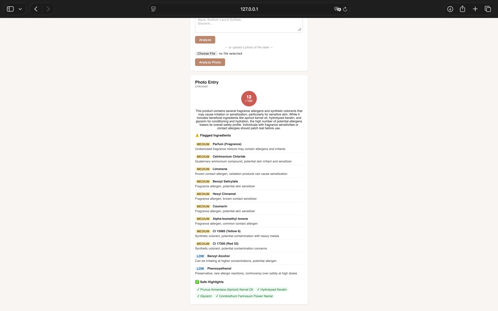
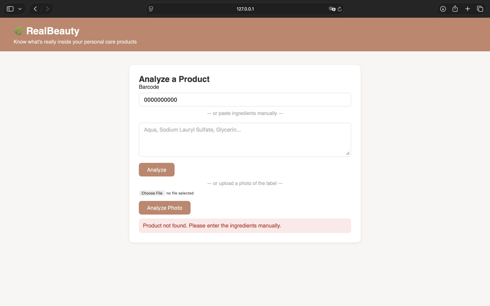
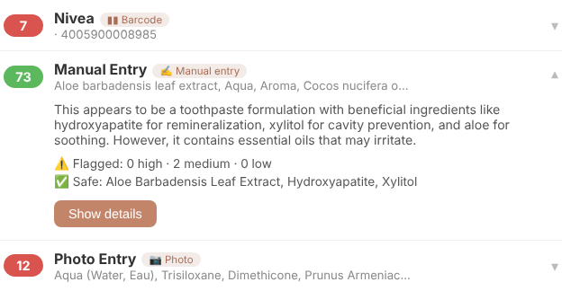

# User Guide

This guide explains how to use RealBeauty once it is running (see [Deployment](../07-deployment/) for the installation). Open <http://127.0.0.1:5000> in a web browser (or the port chosen at start-up).

> RealBeauty is an educational project. The result is produced by an AI model, can be wrong, and is **not** medical or dermatological advice.

## The page

The application is a single page. At the top there is the **Analyze a Product** form, with three ways to give the product to the system, and below it the result appears.



| Input | When to use it |
|-------|----------------|
| **Barcode** | The product has a barcode (the number under the bars) and is likely to be in the Open Beauty Facts database. |
| **Ingredient list** (text box) | The barcode is not known, or the ingredient list is at hand and can be typed or pasted. |
| **Photo of the label** | The ingredient list is printed on the package and typing it would be slow. |

Only one input is needed for each analysis.

## Analysing a product from its barcode

1. Type the barcode in the **Barcode** field, digits only (for example `8718951290006`).
2. Press **Analyze**.
3. Wait for the result. A progress message shows how many seconds have passed. The AI models are free and can take up to about two minutes.



If the product is found, its ingredient list is analysed automatically. If it is not found, or it is found without an ingredient list, the page shows a message and asks for the ingredients: continue as described in the next section.

## Analysing a typed ingredient list

1. Copy the ingredient list from the package or from a web shop and paste it into the large text box. A comma-separated list in the order of the package is the best format, for example `Aqua, Glycerin, Sodium Lauryl Sulfate, Parfum`.
2. Press **Analyze**.



## Analysing a photo of the label

1. Under *or upload a photo of the label*, press **Choose File** and select a photo of the ingredient list. The photo should be sharp, well lit, and show the whole list; JPEG, PNG and WebP files are supported.
2. Press **Analyze Photo**. The system first reads the list from the image and then analyses it.
3. To select another photo, press the **✕** button next to the file name.



If the text cannot be read, the page shows an error; a better photo or the typed list can be used instead. The text read from the photo is not guaranteed to be perfect, so a quick look at the flagged ingredients is advisable.

## Reading the result

The result card contains:

| Element | Meaning |
|---------|---------|
| Product name and brand | From the database, or "Manual Entry" / "Photo Entry" when the ingredients were typed or read from a photo. |
| **Score circle** | A number from 0 to 100: the higher, the safer the ingredient list looks. |
| Summary | A short explanation of the score. |
| **Flagged Ingredients** | Ingredients considered concerning, each with a severity (high, medium or low) and the reason. |
| **Safe Highlights** | Ingredients considered beneficial for skin or hair. |

The colour of the circle gives a quick impression:

| Score | Colour | Reading |
|-------|--------|---------|
| 70 to 100 | Green | The list looks mostly safe. |
| 40 to 69 | Orange | Some ingredients deserve attention. |
| 0 to 39 | Red | Several concerning ingredients. |

The score starts at 100; each high-severity ingredient subtracts 20 points, each medium one 10, each low one 3, and each beneficial ingredient adds 2. The rule is given to the AI model, so two analyses of the same list can differ slightly. The score is a guide for comparing products, not a verdict.

After a successful analysis, the input fields are cleared and the result stays on the screen, so the next product can be entered immediately.

## Messages and problems

| What is shown | Meaning | What to do |
|---------------|---------|------------|
| A message that the product was not found | The barcode is not in Open Beauty Facts, or has no ingredient list. | Type the ingredients or use a photo. |
| A message asking to select a photo first | **Analyze Photo** was pressed without a file. | Choose a file. |
| An error about the photo | The ingredients could not be read from it. | Use a clearer photo or type the list. |
| A message that the AI analysis is temporarily unavailable | The free AI models are busy. The system already tried several of them. | Wait a minute and press the button again. The input is kept. |
| "Network error" | The page cannot reach the application. | Check that the application is still running in the terminal. |



## Previous analyses

Every completed analysis is saved on the computer where the application runs, and the list **Recent Analyses** at the bottom of the page shows the last ten products, newest first. Each product appears once, as a row with its score, its name and the way it was entered (barcode, manual entry or photo). For products without a name, the beginning of the ingredient list is shown instead.

- **Click a row** to see a short summary: the summary text, how many ingredients were flagged at each severity, the high-risk ingredients, and the beneficial ones. Only one row is open at a time; clicking another row closes the first, and clicking the same row again closes it.
- **Press "Show details"** in an open row to see the full result. The page moves up to the result area and shows it exactly as after a new analysis, with a grey note saying that it comes from the history.



**Analysing a product again.** When an ingredient list was already analysed (also with different upper and lower case or spacing), the result appears almost at once, with a grey note saying that it is a saved result and that no new AI analysis was needed. The score is therefore always the same for the same list. For label photos this happens less often, because the text read from a new photo can differ by a letter.

The same list is also available to programs at <http://127.0.0.1:5000/api/v1/history>, in a technical text format (JSON).

## For programmers: using the API

The same functions are available to other programs under the `/api/v1` address, for example:

```bash
curl -X POST http://127.0.0.1:5000/api/v1/analyze \
  -H "Content-Type: application/json" \
  -d '{"ingredients": "Aqua, Glycerin"}'
```

The answer is a JSON object with `product_name`, `brand`, `score`, `summary`, `flagged`, `safe_highlights` and `cached` (true when a saved result was returned). A description of the routes and error codes is in the [Design](../03-design/) section and in the README of the repository.
